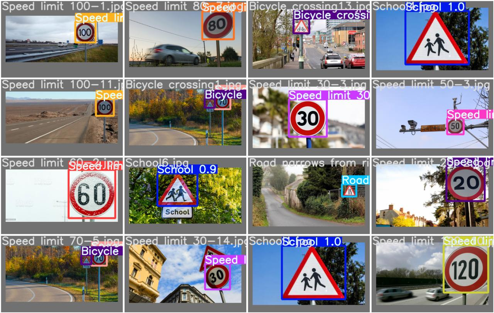
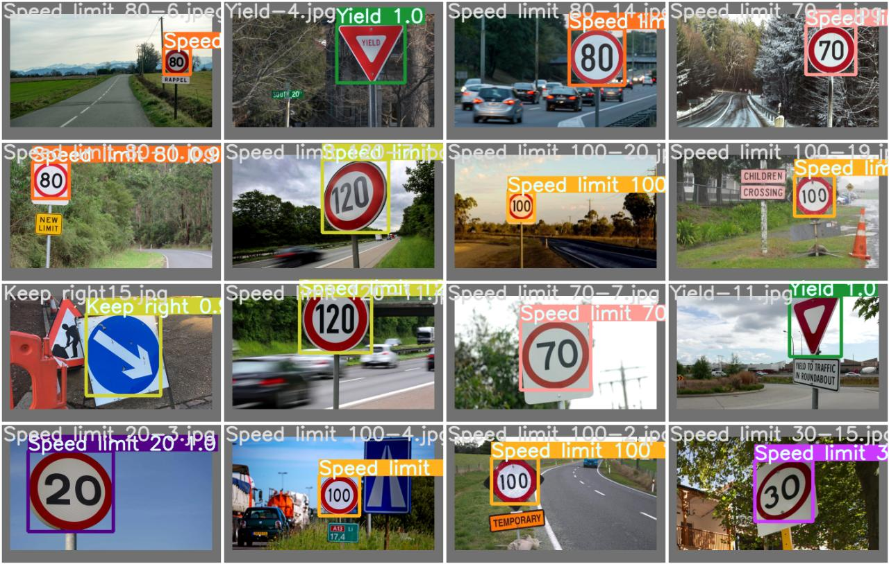
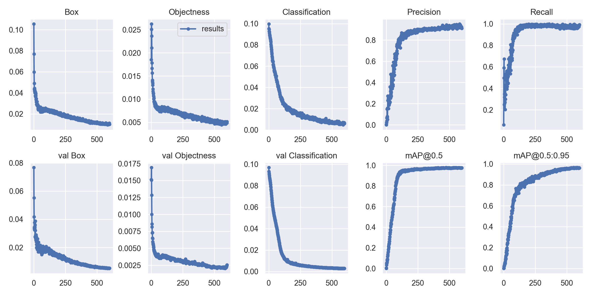

# Road_Sign_Detection
This repo contains the files related to my Final Project during the AI course 
The goal of the project was to build a deep learning model that could detect and classify the 
road signs efficently

I will add my labeled dataset eventually ...

The Dataset was actually quite small but because ive used a pre-trained model with greatly balanced weights, it had good accuracy

Here are some of the Model predictions on the Validation Data :

------------------------------------------

------------------------------------------
And finally this is the summary of results :

